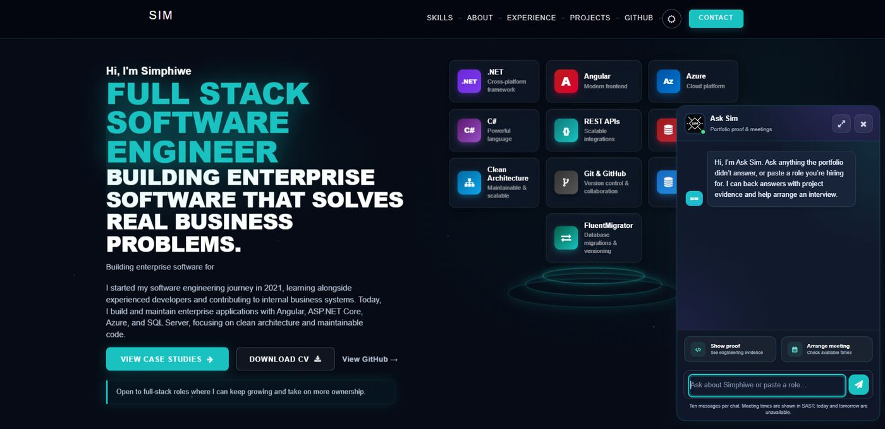
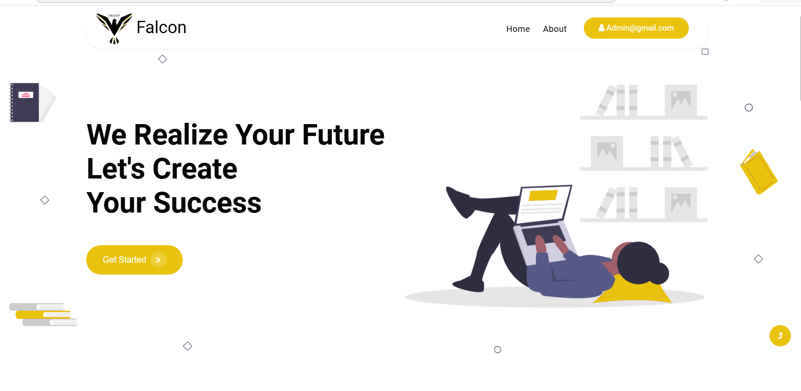

# Hi, I'm Simphiwe Dlamuka 👋

### Full Stack Software Engineer | Angular · .NET · SQL · Azure

I build enterprise software that turns complex business rules into reliable, maintainable systems.

Over the past **4+ years**, I have worked across frontend, backend, APIs and databases—mainly in the insurance domain. My day-to-day engineering has included building Angular workflows, developing C#/.NET services, integrating external systems, writing SQL, investigating production issues and improving existing applications without breaking the journeys customers already depend on.

📍 Durban, South Africa · 🎯 Open to full-stack software engineering opportunities

---

### 💼 What I bring to an engineering team

- **Full-stack delivery:** I can follow a feature from the UI and API through to SQL, testing and deployment.
- **Enterprise experience:** I have worked with policy, claims, customer self-service and internal administration workflows where accuracy matters.
- **Production problem-solving:** I investigated database locking and slow application behaviour, then improved the flow through call consolidation and caching—reducing a key process from roughly one minute to about ten seconds.
- **Ownership:** I ask how a feature affects the whole user journey, not only whether my individual ticket compiles.
- **Maintainability:** I care about readable code, clear boundaries, reusable components, validation and changes that are safe to support after release.

---

### 🛠️ Core stack

**Engineering practices:** REST APIs · Clean Architecture · SOLID · Role-based access · API integrations · Unit testing · Production troubleshooting · Agile delivery

---

### 🚀 Projects I'm proud of

#### [Ask Sim — AI Portfolio Assistant](https://simdevhub.com/)

**The problem:** A recruiter should not need to search through my CV, portfolio and project history just to decide whether I am worth interviewing.

I built Ask Sim directly into my portfolio so recruiters can ask about my experience, compare my background with a role, request proof from real projects and arrange an interview from one focused experience.

**Tech:** C#, ASP.NET, OpenAI API, Google Calendar API, JavaScript, HTML, CSS

**What I engineered:** 💬 grounded portfolio Q&A · 🎯 role-fit analysis · 🧾 project evidence · 📅 calendar availability and interview booking · 🔒 per-session request limits · ✅ confirmation flows · 🌓 responsive light and dark themes

---

#### [Falcon Employee Management System — Live Demo](http://simphiwedlamuka-002-site2.itempurl.com/)

**The problem:** Employee administration becomes slow and difficult to track when leave, approvals, payslips, documents and return-to-work processes are handled across separate manual channels.

I built Falcon as a centralized HR platform with dedicated employee, manager and administrator workflows. It brings employee records, leave approvals, payroll communication and internal notifications into one system.

**Tech:** ASP.NET MVC 5, .NET Framework 4.7.2, Entity Framework 6, SQL Server, ASP.NET Identity 2, Razor Views, Bootstrap 3, JavaScript, jQuery

**What I engineered:** 🔐 role-based access · 🏖️ leave requests and approvals · 👥 employee and department management · 💰 payslip distribution · 📎 document uploads · 📢 notifications · 🔄 return-to-work workflows

---

### 🌱 What I'm improving now

- Deepening my **system design, Clean Architecture and automated testing** skills.
- Expanding my **Azure and DevOps** knowledge for stronger end-to-end delivery.
- Learning **Python** by building a practical high-school learning platform rather than following isolated tutorials.
- Improving how I communicate technical decisions, trade-offs and business value.

---

### 📫 Let's connect

- **Portfolio:** [simdevhub.com](https://simdevhub.com/)
- **LinkedIn:** [Simphiwe Dlamuka](https://www.linkedin.com/in/simphiwe-dlamuka-01022120b/)
- **Email:** [simphiwedlamuka371@gmail.com](mailto:simphiwedlamuka371@gmail.com)

If you are hiring for a full-stack role involving **Angular, .NET, SQL or Azure**, try asking Ask Sim:

> **“Why should we interview Simphiwe?”**
